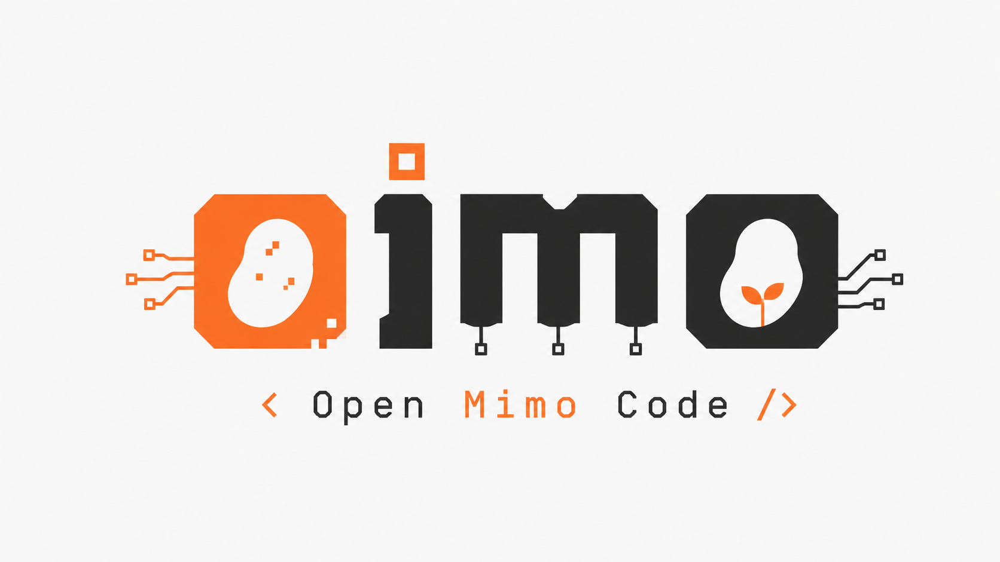

<h1 align="center">Oimo</h1>

<p align="center">
  
</p>

<p align="center"><strong>Open Mimo Code: Where Models and Agents Co-Evolve</strong></p>

<p align="center">
  日本語 | <a href="README.en.md">English</a> | <a href="README.zh.md">中文</a>
</p>

<p align="center">
  <a href="https://github.com/kuwa2005/oimo">GitHub</a> | <a href="https://github.com/kuwa2005/oimo/releases">リリース</a>
</p>

---


Open Mimo Code は、ターミナルネイティブの AI コーディングアシスタントです。コードの読み書き、コマンド実行、Git 操作に加えて、持続的なメモリシステムによってセッションをまたいでプロジェクトへの深い理解を維持し、**自分自身を進化させ続けます**。

OpenCode Zen が無料のデフォルトチャネルとして組み込まれており、ゼロ設定ですぐに始められます。また、主要な LLM プロバイダーの API にも接続できます。


---

## クイックスタート

**macOS / Linux**（ワンラインインストール）:

```bash
curl -fsSL https://raw.githubusercontent.com/kuwa2005/oimo/main/install | bash
```

**Windows PowerShell**（ワンラインインストール）:

```powershell
powershell -ep Bypass -c "irm https://raw.githubusercontent.com/kuwa2005/oimo/main/install.ps1 | iex"
```

配布は GitHub Releases のバイナリのみです（上流の `@mimo-ai/*` npm パッケージとは無関係）。

**実行**:

```bash
oimo
```

初回起動時に自動で設定を案内されます。対応しているオプション:
- **OpenCode Zen（Big Pickle）** — 無料のデフォルトチャネル、設定不要
- **Xiaomi MiMo プラットフォーム** — OAuth ログイン
- **Codex (ChatGPT Pro/Plus)** — OpenAI OAuth ログイン
- **Claude Code からのインポート** — 既存の認証をワンステップで移行
- **プロバイダー一覧** — API キーでカタログプロバイダーに接続、または対応プロバイダーは OAuth（例: xAI/Grok）
- **カスタムプロバイダー** — TUI 上で OpenAI 互換 API を追加

<details>
<summary><strong>WSL: クリップボードの問題</strong></summary>

WSL でコピー時に文字化けする場合は、`xsel` をインストールしてください:
```bash
sudo apt install xsel
```
</details>

<details>
<summary><strong>macOS: 標準ターミナルでの描画問題</strong></summary>

Open Mimo Code は macOS 標準のターミナル（Terminal.app）には対応していません。表示がずれたり、ちらついたり、その他の描画問題が発生する場合は、[iTerm2](https://iterm2.com/) または VS Code 統合ターミナルを使用してください:

```bash
brew install --cask iterm2
```
</details>

<details>
<summary><strong>TUI の遅延とアニメーション表示の問題</strong></summary>

SSH 経由で直接実行すると TUI が遅くなる場合は、表示をローカルで行い、リモートホストでは Open Mimo Code サーバーのみを実行してください。リモートのプロジェクトディレクトリからサーバーを起動します:

```bash
# リモートホスト
oimo serve --port 4096

# ローカルホスト: SSH ポートフォワードを作成
ssh -N -L 4096:127.0.0.1:4096 user@remote-host

# ローカルホスト: 別のターミナルから接続
oimo attach http://127.0.0.1:4096
```

装飾アニメーションが原因で遅い場合は `/vivid` を実行するか、`ctrl+p` コマンドパレットで **Vivid visuals** を設定して、必要に応じて Vivid と Minimal の表示を切り替えてください。

</details>

<details>
<summary><strong>Windows: シェルでの CJK（中国語/日本語/韓国語）文字化け</strong></summary>

非 UTF-8 のシステムロケール（例: アクティブコードページが 936/GBK の zh-CN）の Windows では、CJK 文字を含むコマンド出力が文字化け（mojibake）することがあります。Open Mimo Code は spawn する PowerShell/cmd サブプロセスに対して UTF-8 出力を強制します。それでも対応しきれないケースで文字化けが発生する場合は、Windows のシステム全体の UTF-8 サポートを有効にしてください:

**設定 → 時刻と言語 → 言語と地域 → 管理用の言語設定 →
システムロケールの変更 → 「ベータ: 世界対応の Unicode UTF-8 を使用」にチェック →
再起動。**

これによりアクティブコードページ（ACP）がすべてのプログラムで UTF-8 (65001) に切り替わり、サブプロセスがレガシーコードページを引き継がなくなります。なお、これはシステム全体に影響するベータトグルであり、一部の古い非 Unicode プログラムが正しく表示されなくなる可能性があるため、回避策として扱ってください。
</details>

---

## MiMo エコシステム

Open Mimo Code 以外でも、Xiaomi MiMo モデルは Cursor、Cline、Zed などの他のエージェントやコーディングツールで利用できます。

**[awesome-mimo-agent](https://github.com/XiaomiMiMo/awesome-mimo-agent)** には、それらのツールで MiMo を利用するためのセットアップガイドがまとめられています — 他の場所でも MiMo を試したい場合は必見です。投稿も歓迎します: ご自身のセットアップを PR として追加してください。

---

## 主な機能

### 複数エージェント

| エージェント | 説明 |
|--------|------|
| **build** | デフォルト。開発に必要な全ツール権限を持つ |
| **plan** | コード調査と設計のための読み取り専用の分析モード |
| **compose** | 仕様駆動開発とスキル駆動ワークフローのためのオーケストレーションモード |

`Tab` キーでプライマリエージェントを切り替えます。サブエージェントは必要に応じてシステムが作成します。最初のメッセージ以降はモードが固定されます: Build / Plan / Compose は相互に切り替えられます。Orchestrator などグループ外のエージェントへは、メッセージ開始後は Tab では入れません（`agent_force` で強制切替可）。

最先端モデル（Fable/Sol クラス）では、compose スタイルの作業を実行する推奨方法は **build** エージェントと `/compose-next` スキルです — [Compose モード](#compose-モード) を参照してください。

### 持続的なメモリ

SQLite FTS5 全文検索を利用したセッション横断メモリ:

- **プロジェクトメモリ** (`MEMORY.md`) — プロジェクトの永続的な知識、ルール、アーキテクチャ決定
- **セッションチェックポイント** (`checkpoint.md`) — チェックポイントライターのサブエージェントが自動的に維持する構造化状態スナップショット
- **スクラッチノート** (`notes.md`) — エージェント用の一時的なメモ領域
- **タスク進捗** (`tasks/<id>/progress.md`) — タスクごとのログ

メモリはセッション再開時に自動的に注入されるため、エージェントはプロジェクトのコンテキストを学び直す必要がありません。

### インテリジェントコンテキスト管理

- **自動チェックポイント** — モデルのコンテキストウィンドウに基づいてセッション状態を保存するタイミングを決定
- **コンテキスト再構築** — コンテキストが上限に近づくと、最新のチェックポイント、プロジェクトメモリ、タスク進捗、保持された直近メッセージからコンテキストを再構築し、現在のタスクを継続できるようにする
- **予算制御付きインジェクション** — トークン予算を使って、チェックポイント、メモリ、ノートのどの程度をコンテキストに取り込むかを重要度順に制御
- **圧縮ポイントの調整** — `/context-limit`（または `compaction.max_context`）で、モデルのウィンドウよりも早く圧縮を開始できる（モデルごと）

<details>
<summary><strong>モデルのウィンドウより早く圧縮する（<code>/context-limit</code>）</strong></summary>

圧縮は通常、モデルのコンテキストウィンドウ直前で発動します。`/context-limit` を実行すると、
現在のモデル用に小さめの作業予算を選べます — `200K` / `300K` / `500K` / `1M` または
カスタム値 — モデルごとに `compaction.max_context` として保存されます:

```jsonc
{
  "compaction": {
    "max_context": {
      "openai/gpt-5.6": "272K", // トークン数、"300K"、"1M"、またはウィンドウの "50%"
      "anthropic/*": "300K" // ワイルドカード可、最長のパターンが優先
    }
  }
}
```

値は常にプロバイダーが実際に受け付ける範囲にクランプされるため、圧縮ポイントを
下げることしかできず、上げることはできません。`0` はモデル本来のウィンドウに戻します。

これを使う理由:

- **コスト層。** OpenAI は GPT-5.6 の 272K を超える入力プロンプトを、リクエスト全体に対して入力 2 倍・出力 1.5 倍で課金します。
- **宣伝されているウィンドウが実際の値とは限らない。** 同じモデルでも、アクセス方法（ChatGPT/Codex サブスクリプション、直接 API キー、OpenRouter などのリセラー）によって利用可能ウィンドウが異なるため、カタログの 1M という数字が必ずしもそのルートで 1M 使えることを意味しません。
- **品質とレイテンシ。** 非常に長いコンテキストは遅くなり、ある点を超えると品質も向上しません。

`oimo models <provider>` は、モデルごとに Open Mimo Code が解決したウィンドウと、どのトークン数で
圧縮するかを出力します。プロンプトのフッターにはその同じ数値が分母として表示されます
（`33.0K/260K↓ (13%)` — `↓` は予算が有効であることを意味します）。`/status` で内訳を確認できます。

</details>

### タスク追跡

ツリー状のタスクシステム（`T1`、`T1.1`、`T1.2`、…）で、チェックポイントシステムと自動的に連携するため、セッション再開時にもタスクの進捗が保持されます。

### サブエージェントシステム

プライマリエージェントはオンデマンドでサブエージェントを作成できます。サブエージェントは現在のセッションコンテキストを共有し、並列で作業でき、ライフサイクル追跡、キャンセル、バックグラウンド実行に対応しています。

### ゴール / 停止条件

`/goal` コマンドはセッションの停止条件を設定します。エージェントが停止しようとすると、独立したジャッジモデルが会話を評価して条件が本当に満たされたかを判断し、自律作業中の早すぎる「楽観的停止」を防ぎます。

### Compose モード

Compose は、仕様からデリバリーまでをオーケストレーションする、仕様駆動開発のための Open Mimo Code の構造化ワークフローです。

推奨される使い方は、**build** エージェントの **`/compose-next`** スキルです: grill → spec → workspace → implement → verify → review → finalize → finish をカバーする単一の自己完結型コントラクトで、機能ドキュメントは `docs/compose/spec/<feature>.md` に置きます。ワークフローの大半を内面化し、1 つのコンパクトなコントラクトで最もうまく機能する、最先端モデル（Fable/Sol クラス）向けに設計されています。

レガシーの経路は専用の **compose エージェント**（`Tab` で切り替え）で、計画、実行、コードレビュー、TDD、デバッグ、検証、マージのための 14 の組み込みスキルをオーケストレーションします — 弱いモデルにも有効なステップバイステップのカリキュラムです。

### ワークフロー

ワークフローは、サンドボックス化されたランタイムで複数のエージェントをオーケストレーションする決定論的な JavaScript スクリプトです。エージェントの会話とは異なり、ワークフローはリトライに上限があり、自動並列化される固定のフェーズ列をエンコードします — ユーザー操作を必要としない fire-and-forget 実行です。

Open Mimo Code には 4 つの組み込みワークフローが同梱されています:

| ワークフロー | フェーズ | 説明 |
|----------|--------|-------------|
| `compose` | Brainstorm → Design → Implement → Verify → Review → Report → Merge | 完全な開発パイプライン。独立したタスクを分離された git worktree に自動並列化し、タスクごとに TDD を適用し、フェーズ間で構造化出力をチェーンします。独立したサブタスクに分解できる明確に定義されたタスクに最適です。 |
| `deep-research` | Brief → Plan → Research → Reflect → Write → Review | マルチソースの深層リサーチレポートジェネレーター。独立したリサーチの観点を計画し、並列サブエージェントで引用付きの知見を収集し、ギャップを振り返り、単一の一貫した Markdown レポートを書き、その後引用を冷徹にレビューします。収束型: ファイルチェックポイントで再開可能です。 |
| `fact-check` | Plan → Search → Extract → Group → Crosscheck → Report | 対抗的な事実検証。並列 Web 検索を実行し、検証可能な事実を抽出して重複をグループ化し、それぞれを 3 人の陪審員による対抗投票でクロスチェックします。正確な主張（「X は本当か？」）に最適です。 |
| `research-experiment` | Baseline → Loop → Audit → Report | 機械的に検証可能なメトリクスの自律最適化ループ。ベースラインを確立し、仮説立案 → 実装 → 評価 → 維持/破棄を反復し、メトリクスゲーミングを監査し、再現可能な結果ログを生成します。固定予算の評価コマンドと、明示的な編集対象ファイルの範囲が必要です。 |

compose ワークフローは対話型の経路を補完します: 要件が明確でタスクがきれいに分割できる場合は **workflow** を（決定論的・並列・非対話型）、進行中のリダイレクトやステップ間の判断注入が必要な場合は **build** エージェントと `/compose-next`（またはレガシーの compose エージェント）を使います（対話型）。

**カスタムワークフロー:** `.oimo/workflows/` または `.claude/workflows/` に `.js` ファイルを置いて独自定義するか、同じ名前を使うことで組み込みを上書きできます（例: `.oimo/workflows/compose.js`）。

### 組み込みスキル

スキルは、特定のタスク（PDF 生成、学術論文執筆、arXiv 検索など）の処理方法をエージェントに教える再利用可能な指示セットです。新しいタスクに対して、Open Mimo Code は利用可能な非 Compose スキルを、正確な名前、ローカライズされたエイリアス、BM25 関連度で検索します。信頼度の高い一致は自動的にロードされ、不確実な一致はエージェントが評価できるようにランク付けされます。TUI では `/` を入力してオートコンプリート一覧を参照するか、`/<skill-name>` で直接スキルを呼び出せます — 1 つのメッセージで 2 つ以上のスキルに言及すると自動ロードされ、複数スキルのオーケストレーション計画が注入されます。

Open Mimo Code には次の組み込みスキルが同梱されています:

| スキル | 説明 |
|-------|-------------|
| `arxiv` | arXiv 論文の検索、読解、引用、分析 |
| `claude-code` | コーディング、テスト、レビュー、Git タスクを Claude Code CLI に委任 |
| `codex` | ヘッドレス自動化、CI、コンテナ、リモート環境で Codex CLI を実行・トラブルシュート |
| `compose-next` | 推奨の spec→ship 機能デリバリーワークフロー（grill → spec → implement → verify → review → finish）; `/compose-next` で明示的に呼び出す |
| `data-analytics` | データ品質、KPI、ダッシュボード、レポート、ノートブック、市場規模の再利用可能ワークフローによる製品・ビジネスデータ分析 |
| `deep-research` | 並列サブエージェントと組み込み Web ツールによる、引用付きマルチソースのリサーチレポート生成 |
| `design-blueprint` | ビジュアルのモックアップ前に設計ブループリント（DESIGN.md + Decision Trace）を作成 |
| `docx-official` | Word（.docx）ファイルの作成、読み取り、変換 |
| `drive-mimo` | 別の Open Mimo Code プロセスをヘッドレスまたは対話型 TUI モードでスクリプト化、テスト、自動化 |
| `evolve` | Self Improvement Session — 知識スキル化・backlog・摩擦/HAC 分析・oimo 本体向け AI-to-AI 指示書（ログは `~/.oimo/evolve/<projectID>/`）。`/evolve` または `/self-improve` |
| `frontend-design` | UI 作業のためのビジュアルデザインガイダンス |
| `html-to-video-pipeline` | ヘッドレスブラウザ + ffmpeg による HTML-to-MP4 レンダリング |
| `learn-everything` | ドキュメント、URL、トピックを、演習・フィードバック・進捗追跡付きの適応型コースに変換 |
| `loop` | 固定の周期で反復プロンプトをスケジュール |
| `mimocode-docs` | Open Mimo Code の機能、コマンド、プロバイダー、設定の自己文書化リファレンス |
| `modern-python-toolchain` | uv、Ruff、Pyright を使ったモダンな Python プロジェクトのセットアップ |
| `pdf-official` | PDF ファイルの作成、読み取り、入力、変換 |
| `pptx-official` | PowerPoint（.pptx）デッキの作成と操作 |
| `product-design` | フォーカスしたワークフローによる製品・UX デザインの調査、監査、実装、QA |
| `research-paper-writing` | 学術論文の執筆と推敲（ML/CV/NLP スタイル） |
| `sales` | 営業リサーチ、ミーティング準備、アカウント優先順位付け、取引戦略、予測、CRM ワークフローをサポート |
| `skill-creator` | エージェントスキルの作成と改善のための対話型ガイド |
| `super-research` | 長期的で監査可能なリサーチ、実験、ベンチマーク、診断、再現、引用チェックを実行 |
| `xlsx-official` | スプレッドシート（.xlsx/.csv）の作成、整形、変換 |

`claude-code` と `codex` は、それぞれ `claude` と `codex` の実行ファイルがインストールされている場合にのみ公開されます。他のスキルは、その指示に記述されたタスク固有のツールが必要な場合があります。

**組み込みスキルの上書き:** プロジェクト（`.oimo/skills/<name>/SKILL.md`）または個人スキルディレクトリ（`~/.claude/skills/`、`~/.opencode/skills/` など）に同じ `name` のスキルを作成してください。スキャン順で後から見つかるユーザースキルは、同じ名前の組み込みスキルを上書きします。

<details>
<summary><strong>環境変数による組み込みスキルの無効化</strong></summary>

| 変数 | 効果 |
|----------|--------|
| `MIMOCODE_DISABLE_BUILTIN_SKILLS=true` | すべての組み込みスキルを無効化 |
| `MIMOCODE_DISABLE_OFFICIAL_SKILLS=true` | オフィス/メディア系スキル（`docx-official`、`pdf-official`、`pptx-official`、`xlsx-official`、`html-to-video-pipeline`）のみ無効化 |
| `MIMOCODE_DISABLE_SLASH_SKILLS=true` | 無効化せずにスキルを TUI の `/` オートコンプリートから非表示 |

最初の 2 つのオプションは対応するスキルをエージェントの利用可能スキル一覧から完全に削除するため、コンテキストに現れず、呼び出しもできません。`MIMOCODE_DISABLE_SLASH_SKILLS` は TUI のオートコンプリートのみに影響し、スキルはエージェントから利用可能なままです。

</details>

### 音声入力

TenVAD と MiMo ASR によるリアルタイムストリーミング音声入力。`/voice` で有効にしてから話すと、音声が無音区間で分割され、増分的に入力欄に文字起こしされます。MiMo にログインしているユーザーが利用できます。`sox` が必要です（macOS では `brew install sox`、他のプラットフォームも同様）。

<details>
<summary><strong>WSLg の音声設定</strong></summary>

```bash
sudo apt install -y sox pulseaudio libasound2-plugins
export PULSE_SERVER=unix:/mnt/wslg/PulseServer
```
</details>

<details>
<summary><strong>SSH リモート音声（Mac → リモートホスト）</strong></summary>

```bash
# Mac（ローカル）
brew install pulseaudio
pulseaudio --load="module-native-protocol-tcp auth-ip-acl=127.0.0.1" --exit-idle-time=-1 --daemonize
# ~/.ssh/config に追加: RemoteForward 4713 127.0.0.1:4713

# リモートホスト
apt install -y pulseaudio pulseaudio-utils sox
export PULSE_SERVER=tcp:127.0.0.1:4713
# 確認: pactl info
```
</details>

<details>
<summary><strong>MiMo 以外の音声プロバイダー（OpenRouter、社内 API など）</strong></summary>

音声入力は `voice` 設定フィールドを通じて他の OpenAI 互換プロバイダーにルーティングできます。ASR モデル（`mimo-v2.5-asr`）は MiMo のプラットフォームでのみ利用可能です。音声コントロールモード（`mimo-v2.5`）は OpenRouter および互換リレープラットフォームで利用できます。

**OpenRouter（音声コントロールのみ）:**

`/connect` で OpenRouter にサインインし、設定に追加してください:
```jsonc
{
  "voice": {
    "control_model": "openrouter/xiaomi/mimo-v2.5"
  }
}
```

**社内 / セルフホストリレー（ASR と音声コントロールの両方）:**
```jsonc
{
  "provider": {
    "internal": {
      "options": {
        "baseURL": "https://your-api-gateway.example.com/v1",
        "apiKey": "sk-..."
      },
      "models": {
        "xiaomi/mimo-v2.5-asr": { "name": "MiMo-V2.5-ASR" },
        "xiaomi/mimo-v2.5": { "name": "MiMo-V2.5" }
      }
    }
  },
  "voice": {
    "asr_model": "internal/xiaomi/mimo-v2.5-asr",
    "control_model": "internal/xiaomi/mimo-v2.5"
  }
}
```

カスタムプロバイダーは、認識されるために `models` フィールドに少なくとも 1 つのモデルを登録する必要があります。`voice.*_model` のモデル名はそのまま API に送信されるため、登録済みモデルキーと厳密に一致する必要はありません。

> **注意:** カスタムプロバイダーに登録したモデルはモデル選択一覧に表示されます。ASR 専用モデル（例: `mimo-v2.5-asr`）をコーディングのメインモデルにしないでください。

</details>

### Dream & Distill

- **`/dream`** — 最近のセッショントレースをスキャンし、永続的な知識をプロジェクトメモリに抽出し、古いエントリを削除
- **`/distill`** — 最近の作業から繰り返される手作業ワークフローを発見し、高信頼度の候補を再利用可能なスキル、サブエージェント、またはコマンドとしてパッケージ化

---

## 自己進化（Self Evolution）— oimo の最大のウリ

他のコーディングエージェントが「その場で書く」のに対し、oimo は **運用中に自分のやり方を観測し、摩擦を数値化し、改善案を結晶化**します。モデルの重みを触るのではなく、スキル・フック・バックログ・AI-to-AI 指示書として知識を残します。

```text
案件で使う
  → /evolve（Self Improvement Session）
  → 摩擦 / Human Attention Cost を定量化
  → プロジェクト知識 → .oimo/skills/
  → 製品改善 → ~/.oimo/evolve/<projectID>/briefs/（外部 Agent 向け）
  → evolve-review → 人間承認 → evolve-apply（draft PR）
  → ゲート通過後にマージ → 次サイクル
```

| コマンド / 道具 | 役割 |
|----------------|------|
| `/evolve` · `/self-improve` | 観測→分析→提案のフルパス |
| `/evolve-status` | TUI ダッシュボード（briefs / backlog / snapshots） |
| `evolve_status` tool | metrics · snapshot · rollback · scenarios · gate |
| `evolve-review` / `evolve-apply` | 多視点レビュー / **承認付き** worktree→verify→draft PR |

自己進化ログはプロジェクトを汚さず **`~/.oimo/evolve/<projectID>/`** に集約されます（skills などホットリロード拡張だけが `<worktree>/.oimo/`）。製品ソースの自動パッチはしません — Human-in-the-loop が前提です。

**これが Co-Evolve の実体です。** モデルとエージェントが一緒に良くなる、という README の標語を、閉じたループとして実装しています。

---

## 設定

Open Mimo Code は、オートコンプリートと検証のための公開済み JSON Schema を持つ JSON/JSONC 設定ファイルを使用します。

### ファイルの場所

| ファイル | プロジェクトレベル | グローバル |
|------|--------------|--------|
| メイン設定 | `.oimo/oimo.jsonc`（`.json` も可） | `~/.config/oimo/oimo.jsonc`（`.json` も可） |
| TUI 設定 | `.oimo/tui.json` | `~/.config/oimo/tui.json` |
| 認証情報 | — | `~/.local/share/oimo/auth.json` |

> Windows では、XDG パスは `%LOCALAPPDATA%\oimo\` 配下になります。すべてのパスは `MIMOCODE_HOME` で上書きできます。

### JSON Schema

Open Mimo Code は設定を初回ロードするときに `$schema` フィールドを自動注入するため、エディタでそのまま補完と検証が使えます:

| 設定 | Schema URL |
|--------|-----------|
| `oimo.jsonc` / `oimo.json` | `https://mimo.xiaomi.com/mimocode/config.json` |
| `tui.json` | `https://mimo.xiaomi.com/mimocode/tui.json` |

<details>
<summary><strong>VS Code / Cursor: schema ドメインの信頼設定</strong></summary>

エディタが補完用に schema をダウンロードできるよう、`settings.json` に追加してください:

```json
{
  "json.schemaDownload.trustedDomains": {
    "https://mimo.xiaomi.com/": true
  }
}
```

</details>

<details>
<summary><strong>データディレクトリ</strong></summary>

設定ファイル以外に、Open Mimo Code は実行時データを XDG パス（または `$MIMOCODE_HOME`）配下に保存します:

| ディレクトリ | デフォルト（Linux） | 内容 |
|-----------|----------------|----------|
| data | `~/.local/share/oimo/` | SQLite データベース、認証情報（`auth.json`）、メモリ、ログ |
| state | `~/.local/state/oimo/` | TUI 設定（`kv.json`）、最近のモデル（`model.json`） |
| cache | `~/.cache/oimo/` | 言語サーバー、モデルカタログキャッシュ、スキル |

保存された認証情報を削除するには、データディレクトリから `auth.json` を削除してください。macOS では、XDG データのデフォルトは `~/Library/Application Support/oimo/` です。

</details>

### カスタム OpenAI 互換エンドポイント

プロバイダーが組み込みのモデルカタログにない場合は、ベース URL、API キー、モデル ID を直接指定して設定できます:

```jsonc
{
  "$schema": "https://mimo.xiaomi.com/mimocode/config.json",
  "model": "custom/MODEL_NAME",
  "provider": {
    "custom": {
      "name": "Custom",
      "npm": "@ai-sdk/openai-compatible",
      "only_configured_models": true,
      "models": {
        "MODEL_NAME": {
          "name": "MODEL_NAME"
        }
      },
      "options": {
        "baseURL": "BASE_URL",
        "apiKey": "API_KEY"
      }
    }
  }
}
```

- キーは正確に `baseURL` と `apiKey` を使用してください。
- ベース URL とモデル ID は指定されたとおりに保持してください。Open Mimo Code は既知のプロバイダーを必要とせず、エンドポイントが要求しない限り `/v1` を追加・削除してはいけません。
- `models` 配下のキーはアップストリームのモデル ID です。`model` の最初の `/` だけがプロバイダー ID とモデル ID を分離するため、`/` を含むモデル ID もサポートされています。
- 必要に応じて `custom` を別の未使用の小文字プロバイダー ID に置き換え、トップレベルの `model` 値でも同じ ID を使ってください。
- `@ai-sdk/openai-compatible` は OpenAI 互換 API 用です。異なるワイヤープロトコルを使用するサービスには、プロバイダー固有のアダプターが必要です。

ユーザー全体の設定は `~/.config/oimo/oimo.jsonc`（または同ディレクトリの `oimo.json`）、プロジェクト専用の設定は `.oimo/oimo.jsonc`（または `.json`）に置き、既存の設定とマージしてください。`apiKey` は平文で保存されるため、ファイルは自分だけが読めるようにし、コミットしないでください。設定を検証するには `oimo models` を実行するか、TUI のモデルピッカーを使用してください。

カスタムモデルがサポートする入力モダリティ（画像、音声、動画、PDF）を宣言するには、TUI で `/modalities` を実行してください — 手編集なしで設定に保存されるマルチセレクトダイアログです。

### 主なオプション

- プロバイダーとモデルの選択
- エージェント権限とカスタムエージェント
- チェックポイントとメモリの動作
- MCP サーバー接続
- キーバインドとテーマ

Max Mode（ジャッジ選択による並列 best-of-N 推論）は、設定の `experimental.maxMode` で有効にできます。

<details>
<summary><strong>システム一時ディレクトリ（<code>/tmp</code>）を許可する</strong></summary>

デフォルトでは、プロジェクトの作業ディレクトリ外のファイル読み書きは — システムの一時ディレクトリも含めて —
`external_directory` 権限プロンプトを引き起こします。これは意図的です: Open Mimo Code は許可を静かに広げないため、
モデルがプロジェクト外で触れる範囲を自分でコントロールできます。

一時ディレクトリは、ほとんどのモデルがスクラッチスペースとして使うため（例:
簡単なスクリプト、使い捨てのデータファイル）、よく話題になります。環境を信頼していて、
毎回プロンプトされるのを避けたい場合は、設定で許可してオプトインできます:

```json title=".oimo/oimo.json"
{
  "$schema": "https://mimo.xiaomi.com/mimocode/config.json",
  "permission": {
    "external_directory": {
      "/tmp/**": "allow"
    }
  }
}
```

**この設定には既知のリスクがあります — 自己責任で使用してください。** 一時ディレクトリは
誰でも書き込め、マシン上の他のすべてのプロセスやユーザーと共有されます。自動許可すると、
モデルが確認なしでそこに読み書きできるようになり、予測可能な一時パス/シンボリックリンク攻撃
（例: 別のプロセスが `/tmp/foo` を機密ファイルへのシンボリックリンクとして事前作成する）への
露出が広がります。そのため、シングルユーザーの管理された環境か、コンテナ内でのみ推奨します。
許可リストは可能な限り狭く保ってください。

</details>

<details>
<summary><strong>権限プロンプトをスキップする（<code>--dangerously-skip-permissions</code>）</strong></summary>

信頼できる使い捨て環境（コンテナ、サンドボックス、CI）では、毎回確認する代わりにエージェントが
行うすべてを自動承認できます:

```bash
# TUI — 起動時に明示的な確認を 1 回だけ要求
oimo --dangerously-skip-permissions

# ヘッドレス
oimo run --dangerously-skip-permissions "your prompt"

# または環境変数（あらゆる画面で）
MIMOCODE_DANGEROUSLY_SKIP_PERMISSIONS=1 oimo
```

これは**設定の下に allow-all のベースを注入する**ため、ルールのないツールは自動承認されますが、
自分で書いた明示的なルールは引き続き優先されます（最後に一致するルールが勝ち、自分のルールは注入された
`*` の後に置かれます）。`deny` は引き続きブロックします。なお、残っている `ask` ルールもプロンプトされ、
トップレベルの `"*": "ask"` はこのフラグを無効化します。TUI では赤い警告が表示され、有効化前に
リスクを承諾する必要があります（TTY がない場合はプロンプトがスキップされるため、CI では確認なしで有効になります）。

**これは危険です。** 権限をバイパスすると、悪意のあるプロンプト、ファイル、またはプラグインが、
確認なしで任意のシェルコマンドを実行し、データを読み取り、変更、または外部送信できます。
ワークスペースを完全に信頼できる場合にのみ使用してください。

より軽量なオプションとして、`/skip-permissions` コマンドは TUI 内で実行時に自動許可を切り替えます:
`deny` ルールは引き続きブロックし、強制確認操作（例: 破壊的な bash）はハングする代わりに 60 秒後に
自動拒否し、モデルが行動できるフィードバックを返します。

</details>

---

## 開発

```bash
bun ci                   # 依存関係をインストール（= bun install --frozen-lockfile）
bun run dev              # 開発モードで実行
bun turbo typecheck      # 型チェック
```

---

## OpenCode との関係

Open Mimo Code は [OpenCode](https://github.com/anomalyco/opencode) のフォークとして構築されています。OpenCode の全コア機能（複数プロバイダー、TUI、LSP、MCP、プラグイン）を保持しつつ、持続的なメモリ、インテリジェントコンテキスト管理、サブエージェントオーケストレーション、ゴール駆動の自律ループ、compose ワークフロー、dream/distill による自己改善を追加しています。

**他製品との比較**（Cursor / Claude Code / Codex / 一般エージェントを含む）: [docs/oimo-differentiators.ja.md](docs/oimo-differentiators.ja.md)

---

## コミュニティ

QR コードをスキャンしてコミュニティのグループチャットに参加してください:

<p align="center">
  
  &nbsp;&nbsp;
  
</p>

---

## ライセンス

ソースコードは [MIT ライセンス](./LICENSE) の下で提供されます。

Open Mimo Code の利用には [利用制限](./USE_RESTRICTIONS.md) も適用されます。
Xiaomi MiMo がホストするサービスの利用には、[MiMo 利用規約](https://platform.xiaomimimo.com/docs/terms/user-agreement) が適用されます。
MiMo の名称、ロゴ、商標の使用には、MiMo 商標ポリシーが適用されます。
