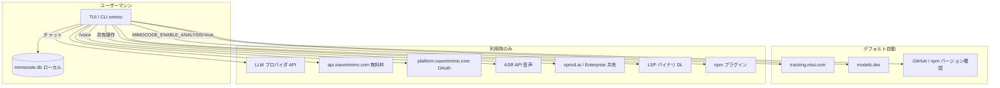

# oimo 外部送信監査レポート

**監査日:** 2026-08-06  
**対象:** oimo リポジトリ（ソース・スクリプト・インストーラ）  
**目的:** 外部へのデータ送信先・送信内容の特定、およびバックドア的挙動の有無確認

---

## 1. エグゼクティブサマリー

| 区分 | 結果 |
|------|------|
| 意図的なバックドア | **検出されず** |
| デフォルトで有効な外部送信 | **あり**（利用状況メトリクス → Xiaomi トラッキング） |
| ユーザー操作・設定に依存する送信 | **多数**（LLM API、共有、音声、プラグイン等） |
| 開発・CI 専用スクリプト | **あり**（PostHog、npm ミラー同期等。ランタイムには含まれない） |

**最重要所見:** 通常利用時、プロンプト本文やファイル内容が **自動的に** Xiaomi 分析基盤へ送られる実装は見つかりませんでした。ただし **`MIMOCODE_ENABLE_ANALYSIS` がデフォルト有効** で、モデル呼び出し・ツール実行・エージェント要求の **メタデータ** が `https://tracking.miui.com/track/v4/o` へ POST されます。LLM への送信（プロンプト・コード・画像）は **選択したプロバイダ API** への通信であり、製品の中核機能です。

---

## 2. 監査範囲・方法

### 対象

- `packages/opencode/src/` — CLI / TUI / サーバー本体
- `packages/opencode/script/` — ビルド・postinstall
- `install`, `install.ps1`, `local-install.sh`
- `script/` — リリース・統計用スクリプト
- `packages/function/`, `packages/web/` — 共有・Web 関連（参考）

### 手法

- `fetch`, `https://`, `WebSocket`, `tracking`, `telemetry`, `posthog` 等の静的検索
- メトリクス・認証・共有・インストール・プラグイン・LSP モジュールのコードレビュー
- `eval`, `new Function`, 難読化 URL、隠しエンドポイントのパターン検索

---

## 3. 外部送信一覧

### 3.1 デフォルト有効（オプトアウト可能）

#### A. 利用状況メトリクス（Xiaomi トラッキング）

| 項目 | 内容 |
|------|------|
| **送信先** | `https://tracking.miui.com/track/v4/o` |
| **実装** | `packages/opencode/src/metrics/client.ts`, `subscriber.ts` |
| **有効条件** | `MIMOCODE_ENABLE_ANALYSIS` が未設定または true（**デフォルト: 有効**） |
| **無効化** | `MIMOCODE_ENABLE_ANALYSIS=false` または `0` |
| **App ID** | `31000402765` |

**送信イベントとペイロード（プロンプト本文・ファイル内容は含まない）:**

| イベント | 送信フィールド |
|----------|----------------|
| `model_call` | `finish_reason`, `ttft_ms`, `latency_ms`, `cached_read_tokens`, `model_id`, `provider`, `total_tokens_in`, `total_tokens_out` |
| `tool_call` | `tool_name`, `input_bytes`, `output_bytes`, `tool_call_id`, `tool_call_status`（**バイト数のみ。引数・出力の中身は送らない**） |
| `agent_request` | `phase`, `task_type`, `surface`, `total_tokens_in`, `total_tokens_out`, `files_changed`, `validation_status` |
| `try_best_detected` | `reason`, `provider`, `model_id`, `count`, `similarity`, `action` |

**ヘッダー（各イベント）:**

- `instance_id`: 送信ごとに生成されるランダム UUID
- `uid` / `uid_type`: セッション ID（`session_id`）
- `e_ts`: タイムスタンプ

**注意:** `installation_id`（`~/.mimocode/data/installation_id` に保存）は起動時にファイル生成のため触れますが、**ワイヤ上のペイロードには含まれません**（コメントで明示）。

---

#### B. モデルカタログ取得

| 項目 | 内容 |
|------|------|
| **送信先** | `https://models.dev/api.json`（`MIMOCODE_MODELS_URL` で上書き可） |
| **実装** | `packages/opencode/src/provider/models.ts` |
| **タイミング** | 起動時・5 分 TTL・1 時間ごとの refresh |
| **送信内容** | GET リクエスト、`User-Agent: mimocode/<channel>/<version>/<client>` |
| **無効化** | `MIMOCODE_DISABLE_MODELS_FETCH=true`（ビルド同梱スナップショットにフォールバック） |

---

#### C. 自動アップデート確認

| 項目 | 内容 |
|------|------|
| **送信先** | GitHub Releases（`https://github.com/kuwa2005/oimo/releases/latest`）または npm registry（`@mimo-ai/cli`） |
| **実装** | `packages/opencode/src/installation/index.ts` |
| **送信内容** | バージョン情報取得のみ（利用統計ではない） |
| **無効化** | `MIMOCODE_DISABLE_AUTOUPDATE=true` |

---

### 3.2 機能利用時に発生（ユーザー意図・設定に依存）

#### D. LLM プロバイダ API（中核機能）

| 項目 | 内容 |
|------|------|
| **送信先** | 設定・選択したプロバイダ（`models.dev` / `models-snapshot.js` 参照） |
| **代表例** | `https://api.xiaomimimo.com/v1`（Xiaomi/MiMo）、OpenAI、Anthropic、各種互換 API 等 |
| **送信内容** | **プロンプト、会話履歴、添付画像、ツール結果** — エージェント動作に必要な全コンテキスト |
| **Referer** | 一部プロバイダ向けに `https://mimo.xiaomi.com/coder/` が付与（`provider.ts`） |

**Tor 経由:** `MIMOCODE_TOR=true` で omimo 自身のネットワーク（モデル・API 呼び出し）を SOCKS5 プロキシ経由に可能（`packages/opencode/src/util/tor.ts`）。

---

#### E. MiMo 無料枠（mimo-free プラグイン）

| 項目 | 内容 |
|------|------|
| **送信先** | `https://api.xiaomimimo.com/api/free-ai/bootstrap`（JWT 取得）<br>`https://api.xiaomimimo.com/api/free-ai/openai/...`（チャット） |
| **実装** | `packages/opencode/src/plugin/mimo-free.ts` |
| **送信可否** | **デフォルト遮断。** `MIMOCODE_ENABLE_MIMO_FREE=true` を明示設定しない限り、`bootstrap()` は fetch 前に中断し、`mimo` プロバイダ / `mimo-auto` モデルも登録されない（2026-07-26 の無料枠終了に伴う対処。将来の無料モデル再開時はフラグのみで再活性化可） |
| **bootstrap 送信** | `{ client: "<fingerprint>" }` — 端末フィンガープリント（下記） |
| **ヘッダー** | `Authorization: Bearer <jwt>`, `X-Mimo-Source: mimocode-cli-free` |

**フィンガープリント生成（`mimo-free-client` に永続化）:**

```
SHA256(hostname | "linux" | "x64" | cpu_model | username)
```

ホスト名・CPU モデル・OS ユーザー名から派生。レート制限用とコメントされている。
`--tor`（`MIMOCODE_TOR`）使用時は永続化せず、1 時間ごとにウィンドウ値を混ぜてローテーションするため、同一マシンへの再結び付けができない。

---

#### F. MiMo アカウント OAuth

| 項目 | 内容 |
|------|------|
| **送信先** | `https://platform.xiaomimimo.com/authorize`（`MIMO_PLATFORM_URL` で上書き可） |
| **実装** | `packages/opencode/src/plugin/mimo.ts` |
| **フロー** | ローカル `http://localhost:<port>/` でコールバック → 暗号化パラメータ `u` を復号 → API キー・uid・base_url 取得 |
| **チャット時** | `X-Mimo-Source: mimocode-cli` ヘッダー |

---

#### G. 音声入力（/voice）

| 項目 | 内容 |
|------|------|
| **送信先** | 設定 ASR プロバイダ（デフォルト `https://api.xiaomimimo.com/v1/chat/completions`） |
| **実装** | `packages/opencode/src/cli/cmd/tui/util/voice.ts` |
| **送信内容** | **WAV 形式の音声データ（base64）**、モデル名、`asr_options` |
| **ヘッダー** | `X-Mimo-Source: mimocode-cli` |
| **条件** | ユーザーが音声機能を起動し、MiMo ログイン等の認証情報がある場合 |

---

#### H. Web 検索ツール（websearch）

| 項目 | 内容 |
|------|------|
| **送信先** | `https://api.xiaomimimo.com/v1/chat/completions`（Xiaomi プロバイダ利用時） |
| **実装** | `packages/opencode/src/tool/websearch/mimo.ts` |
| **送信内容** | 検索クエリ文字列、web_search ツール設定 |
| **条件** | エージェントが websearch を呼び出し、権限承認後 |

---

#### I. Web 取得ツール（webfetch）

| 項目 | 内容 |
|------|------|
| **送信先** | エージェント／ユーザーが指定した任意 URL |
| **実装** | `packages/opencode/src/tool/webfetch.ts` |
| **保護** | SSRF 対策（プライベート IP・メタデータ URL ブロック、`packages/opencode/src/util/ssrf.ts`） |
| **条件** | 権限プロンプト承認後 |

---

#### J. セッション共有（Share）

| 項目 | 内容 |
|------|------|
| **送信先** | デフォルト `https://opncd.ai`（レガシー API）<br>Enterprise アカウント時は org の URL |
| **実装** | `packages/opencode/src/share/share-next.ts` |
| **送信内容** | セッション情報、メッセージ、パーツ（ツール出力含む）、diff、モデル情報 |
| **条件** | ユーザーが共有操作、または `share: "auto"` / `MIMOCODE_AUTO_SHARE` |
| **無効化** | `MIMOCODE_DISABLE_SHARE=true` または config `share: "disabled"` |

**共有時のサニタイズ:** MCP ツールメタデータの `_meta` フィールドは除去される。

---

#### K. LSP サーバーの自動ダウンロード

| 項目 | 内容 |
|------|------|
| **送信先** | GitHub Releases、JetBrains CDN、HashiCorp、Eclipse 等（言語ごと） |
| **実装** | `packages/opencode/src/lsp/server.ts` |
| **送信内容** | バイナリ／アーカイブの GET のみ |
| **無効化** | `MIMOCODE_DISABLE_LSP_DOWNLOAD=true` |

---

#### L. プラグイン（npm / ローカル）

| 項目 | 内容 |
|------|------|
| **送信先** | npm registry（`registry.npmjs.org` またはユーザー設定） |
| **実装** | `packages/opencode/src/npm/index.ts`, `plugin/install.ts` |
| **リスク** | **インストールしたプラグインは任意コード実行可能**（TUI に警告文言あり） |
| **ビルトイン** | `MimoAuthPlugin`, `MimoFreeAuthPlugin`, Codex, Copilot, Cloudflare 等（`plugin/index.ts`） |

---

#### M. リモート設定（well-known）

| 項目 | 内容 |
|------|------|
| **送信先** | 認証設定の `wellknown` 型で指定された `<url>/.well-known/opencode` |
| **実装** | `packages/opencode/src/config/config.ts` |
| **送信内容** | GET（1 秒タイムアウト）→ 返却 JSON を設定としてマージ |
| **条件** | ユーザーが well-known 認証を設定している場合 |

---

#### N. OpenTelemetry（オプトイン）

| 項目 | 内容 |
|------|------|
| **送信先** | `OTEL_EXPORTER_OTLP_ENDPOINT` + `/v1/traces`, `/v1/logs` |
| **実装** | `packages/opencode/src/effect/observability.ts` |
| **条件** | 環境変数が設定されている場合のみ |
| **追加** | config `experimental.openTelemetry` で AI SDK スパン |

---

#### O. GitHub 連携 CLI

| 項目 | 内容 |
|------|------|
| **送信先** | `api.github.com`、GitHub OIDC エンドポイント等 |
| **実装** | `packages/opencode/src/cli/cmd/github.ts` |
| **条件** | `mimocode github` サブコマンド利用時 |

---

#### P. MCP サーバー

| 項目 | 内容 |
|------|------|
| **送信先** | ユーザー設定の MCP サーバー（stdio / HTTP / SSE） |
| **例** | Exa 有効時 `https://mcp.exa.ai/mcp`（`MIMOCODE_ENABLE_EXA` / `EXA_API_KEY`） |
| **送信内容** | MCP プロトコルに従う（ツール定義・サンプリング要求等） |

---

### 3.3 インストール・配布スクリプト（初回セットアップ時）

| スクリプト | 外部通信 | 内容 |
|-----------|----------|------|
| `install` / `install.ps1` | GitHub Releases | プラットフォーム別バイナリ DL（`kuwa2005/oimo`） |
| `local-install.sh` | なし（ローカルビルドのみ） | — |
| `packages/opencode/script/postinstall.mjs` | なし（npm 同梱バイナリをリンク） | 移行案内 URL を stdout に表示 |
| `packages/opencode/src/installation/index.ts`（upgrade） | `raw.githubusercontent.com/.../install` | アップグレード時に install スクリプト取得・実行 |

---

### 3.4 開発・CI 専用（エンドユーザー CLI には通常含まれない）

| スクリプト | 送信先 | 内容 |
|-----------|--------|------|
| `script/stats.ts` | `https://us.i.posthog.com/i/v0/e/` | ダウンロード数（`POSTHOG_KEY` 必須） |
| `script/stats.ts` | npm / GitHub API | 統計収集 |
| `script/sync-registry.ts` | npmmirror / 腾讯云 / 华为云 npm ミラー | パッケージ同期 |
| `script/github/*.ts` | GitHub API | Issue 操作等 |

---

## 4. バックドア調査

### 4.1 実施した確認

| 観点 | 結果 |
|------|------|
| ハードコードされた未知の exfil URL | **なし**（分析用 `tracking.miui.com` はコード上明示） |
| Base64 / 難読化された URL | **なし**（JWT デコード等は認証用途のみ） |
| 秘密の POST / 非ドキュメント API | **なし** |
| プロンプト本文の密かな送信 | **なし**（メトリクスはバイト数・メタデータのみ） |
| インストーラの任意コード実行 | install スクリプトは GitHub から **公開リリース** を DL。`irm \| iex` パターンは Windows postinstall **案内文のみ** |
| 隠しリモートシェル | **なし** |

### 4.2 バックドアではないが注意が必要な拡張面

これらは **意図された拡張機能** ですが、悪意ある設定・プラグイン・プロンプトによりデータが外部へ出る経路になり得ます。

1. **プラグインシステム** — npm / ローカル JS の動的ロード、フックで任意処理可能  
2. **リモート well-known 設定** — 信頼できない URL から設定注入  
3. **セッション共有** — 会話全体を第三者サービスへ  
4. **bash / exec / tool-script** — エージェントがシェル・QuickJS サンドボックス内スクリプト実行（権限モデル依存）  
5. **MCP サーバー** — 外部プロセス／HTTP との双方向通信  
6. **デバッグ CLI** — `packages/opencode/src/cli/cmd/debug/agent.ts` で `new Function` による params パース（**debug 専用**）

### 4.3 結論

**専用のバックドア（開発者による秘密の遠隔操作・データ窃取チャネル）は検出されませんでした。**

ただし、**デフォルト ON の利用メトリクス送信** と **LLM プロバイダへのフルコンテキスト送信** は、プライバシー・コンプライアンスの観点で「外部送信」として認識・管理する必要があります。

---

## 5. データフロー概要



---

## 6. リスク評価

| リスク | 深刻度 | 説明 |
|--------|--------|------|
| デフォルト分析送信 | **中** | 利用パターン・セッション ID・モデル名等が Xiaomi 基盤へ。本文は送らないがオプトイン UI はない |
| LLM プロバイダへのデータ | **高**（機密コードがある場合） | プロンプト・リポジトリ内容がプロバイダ側へ。エージェント製品として必然 |
| mimo-free フィンガープリント | **低〜中** | 端末識別子。hostname/username 由来 |
| セッション共有 | **高**（誤操作時） | 明示操作が必要だが、auto share 設定で自動化可 |
| プラグイン / MCP | **高**（悪意ある場合） | サプライチェーン・設定ミス |
| webfetch SSRF | **低**（緩和済） | プライベート IP 等ブロック実装あり |
| リモート well-known | **中** | 信頼境界外 URL から config マージ |

---

## 7. 推奨事項

### プライバシー重視環境

```bash
# 利用メトリクスを無効化
export MIMOCODE_ENABLE_ANALYSIS=false

# モデルカタログの外部 fetch を止める（同梱スナップショット使用）
export MIMOCODE_DISABLE_MODELS_FETCH=true

# 自動アップデート確認を止める
export MIMOCODE_DISABLE_AUTOUPDATE=true

# 共有機能を無効化
export MIMOCODE_DISABLE_SHARE=true

# 外部スキル・Claude 互換設定の継承を制限
export MIMOCODE_MIMO_ONLY=true
```

### エンタープライズ / エアギャップ

- 自前 LLM エンドポイント + `MIMOCODE_DISABLE_PROVIDER_ENV` / プロバイダ設定の明示管理
- `MIMOCODE_TOR=true` またはネットワークポリシーで egress 制限
- プラグインをホワイトリスト化、well-known 認証の禁止
- OTEL は自社コレクター URL のみ許可

### 監査の継続

- `models-snapshot.js` はビルド生成物 — プロバイダ API URL の変更はビルドパイプラインで追跡
- ユーザー追加プラグインは本監査対象外 — 導入時に個別レビュー推奨

---

## 8. 主要ソース参照

| 機能 | ファイル |
|------|----------|
| メトリクス送信 | `packages/opencode/src/metrics/client.ts`, `subscriber.ts` |
| 分析フラグ | `packages/opencode/src/flag/flag.ts`（L73–75） |
| MiMo 無料 API | `packages/opencode/src/plugin/mimo-free.ts` |
| MiMo OAuth | `packages/opencode/src/plugin/mimo.ts` |
| モデル catalog | `packages/opencode/src/provider/models.ts` |
| セッション共有 | `packages/opencode/src/share/share-next.ts` |
| 音声 ASR | `packages/opencode/src/cli/cmd/tui/util/voice.ts` |
| SSRF 保護 | `packages/opencode/src/util/ssrf.ts` |
| インストール | `install`, `packages/opencode/src/installation/index.ts` |
| PostHog（CI） | `script/stats.ts` |

---

## 9. 免責

本レポートは **2026-08-06 時点のソース静的解析** に基づきます。実行時のネットワークポリシー、ユーザー設定、追加プラグイン、フォーク差分、ビルド済みバイナリとソースの不一致は別途確認が必要です。
